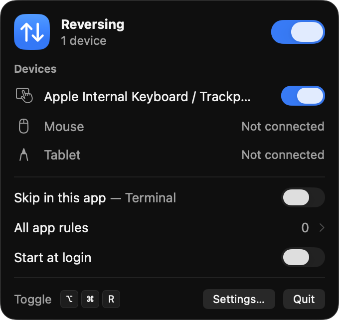
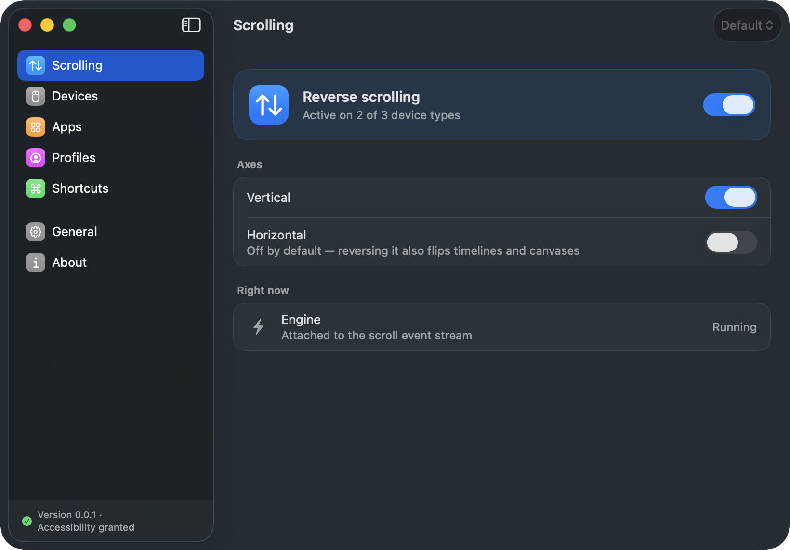
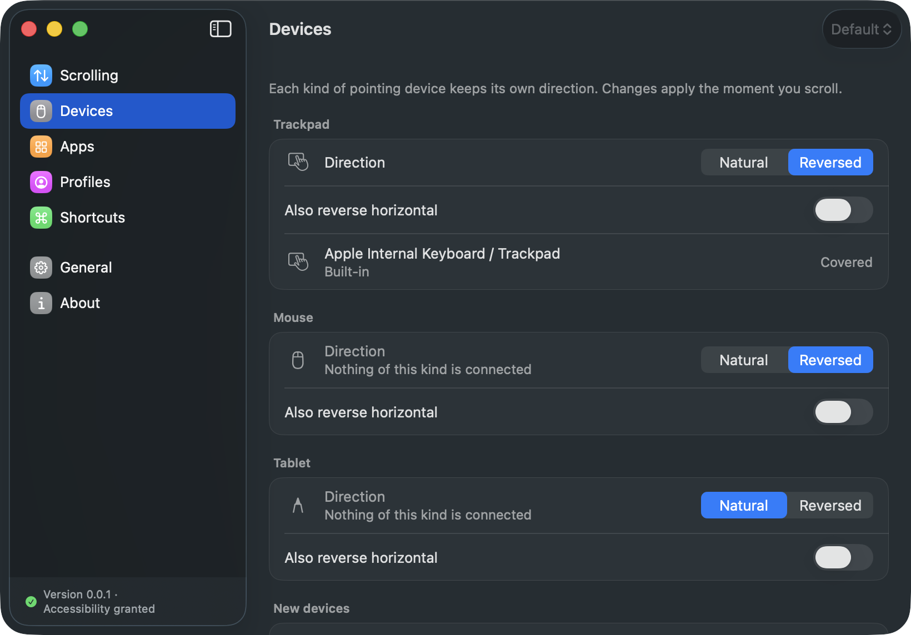
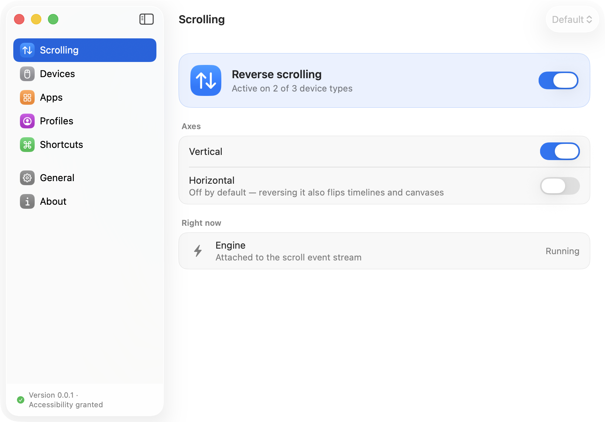
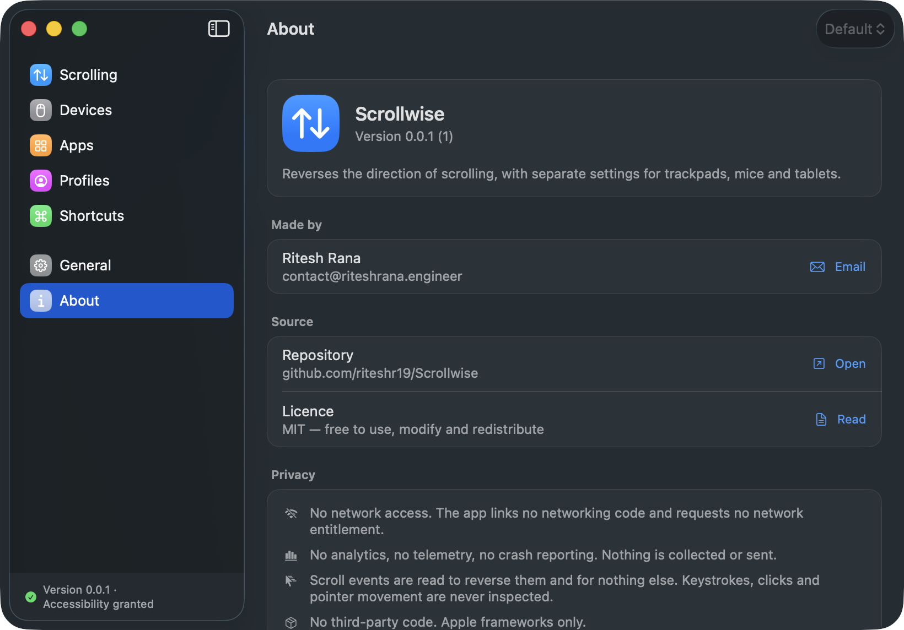

# Scrollwise

Reverses the direction of scrolling on macOS, with independent settings for
trackpads and mice. Menu bar utility, macOS 26+.

Built from a design canvas exploring four architectures — this implements
option **1b** (sidebar + detail settings window) and option **1d** (menu bar
popover), which are complementary rather than alternatives. The canvas is not
part of this repository; `docs/FRONTEND-AUDIT.md` records what it contained and
how each control maps to a native surface.

## Screenshots

The menu bar popover — everything reachable without opening a window.



The Scrolling pane. "Right now" reports what the engine is actually doing rather
than what the settings hope it is doing.



Devices, listing the real hardware under the rule that governs it. macOS does not
tell an app which individual mouse produced a scroll, so rules act on the device
*class* — the pane says so rather than faking per-device switches.



Light mode. Every colour is semantic, so appearance, Increase Contrast and
Reduce Transparency are handled by the system rather than by hand.



About.



## Build and run

```bash
./Scripts/build-app.sh release     # → build/Scrollwise.app
open build/Scrollwise.app
```

Then grant Accessibility access: **System Settings › Privacy & Security ›
Accessibility**. The app opens its window on first launch to explain why, and
picks up the change within about a second — no restart.

Until access is granted the engine stays stopped and the interface says so.
Nothing pretends to work.

## Verify

```bash
swift run ScrollwiseVerify     # 34 checks, no Xcode required
swift test                         # full suite; needs Xcode for `Testing`
```

## Layout

```
Sources/ScrollwiseCore/     pure logic — no AppKit, no CoreGraphics
  Model/                        settings, rules, deltas, device types
  Classification/               event traits → device class
  Transform/                    flip decision + momentum latch
  Settings/                     persistence and shipped defaults
Sources/ScrollwiseApp/      the application
  Engine/                       event tap, thread boundary, CGEvent access
  Services/                     accessibility, login item, HID, shortcut
  UI/MenuBar/                   option 1d
  UI/Settings/                  option 1b
Sources/ScrollwiseVerify/   framework-free test runner
Tests/                          swift-testing suite
docs/                           architecture, audit, test plan, checklist
```

## Contributing

`AGENTS.md` holds the working notes for this repository — commands, the module
boundary, the invariants, and the traps that have already cost time (TCC and code
signing, HID device classification, `SMAppService` status). Coding agents read it
automatically; it is worth a human read too. `CLAUDE.md` imports it so there is
one file to maintain.

## Documentation

- [docs/ARCHITECTURE.md](docs/ARCHITECTURE.md) — layers, event pipeline, threading, permissions, recovery
- [docs/FRONTEND-AUDIT.md](docs/FRONTEND-AUDIT.md) — what the canvas contained, the glass finding, control mapping
- [docs/TEST-PLAN.md](docs/TEST-PLAN.md) — automated coverage and the manual matrix
- [docs/PRODUCTION-CHECKLIST.md](docs/PRODUCTION-CHECKLIST.md) — signing, notarization, known limitations

## Notes

- **Not sandboxed.** A sandboxed process cannot hold the Accessibility right an
  event tap needs. Distribution is Developer ID, not the App Store.
- **No third-party dependencies.** AppKit, SwiftUI, CoreGraphics, IOKit,
  ServiceManagement, Carbon (for the global hot key), OSLog.
- **No private API.**

## Author

Ritesh Rana — <contact@riteshrana.engineer>

## Licence

MIT. See [LICENSE](LICENSE).

## Privacy

Scrollwise links no networking code, requests no network entitlement, and has no
third-party dependencies. It reads scroll events in order to reverse them and
inspects nothing else — not keystrokes, not clicks, not pointer movement. The
event tap's mask is `scrollWheel` only, so its callback is never consulted for
any other kind of input. Nothing is collected, stored off-device, or sent.

Scrollwise needs Accessibility access because modifying an input event requires
it. It deliberately does **not** ask for Input Monitoring: device names come from
IOKit properties, which can be read without opening the devices.
